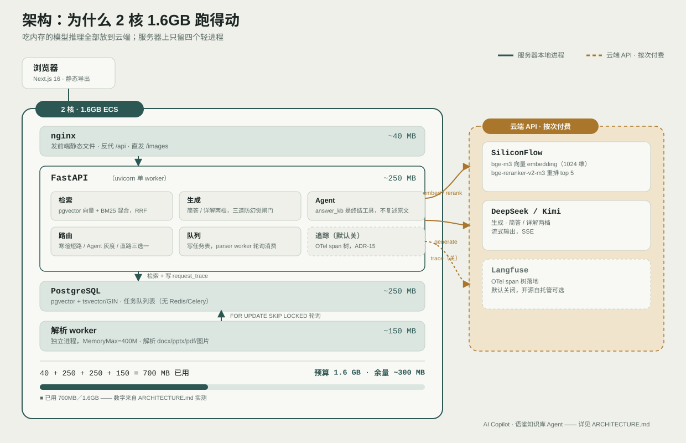

# AI Copilot

[](https://github.com/GG-BIGBOM/AI-Copilot/actions/workflows/ci.yml)

**旺店通旗舰版 ERP 的知识库 Agent。** 公网上线中：<https://liushun666.cn/>

> 一个 ERP 实施顾问每天要回答几十遍同样的问题：这个开关在哪、这个参数上限是多少、
> 这个平台和那个平台的规则差在哪。答错的代价不是"不好用"——
> **一个编出来的配置步骤，能让客户第二天的订单卡在仓库里。**
>
> 所以这个项目真正在解决的不是"能不能答"，是**"敢不敢让它答"**。

## 三分钟看什么

### 一、它把幻觉打到了 0，而且是量出来的

M7 时模型自己写答案，41 道题上准确率 87.8%、**幻觉率 12.5%**。
M10 把答案生成**收进一个终结工具**——模型再也看不到原始材料，
它只能决定"要不要查"，不能决定"答什么"：

|  | M7（模型自己写） | M10（终结工具） |
|---|---|---|
| 准确率 | 87.8% | **100%** |
| 幻觉率 | 12.5% | **0%** |

⭐ 这是整个项目最值得深挖的一段，写在 [ARCHIVE.md 的 M10 一节](ARCHIVE.md)。
代价也写了：**模型看不到答案，调试变难。**

### 二、七条硬指标进门禁，不达标退出码非 0

`eval/gate.py` 读的是**证据**不是重新制造证据（跑一次全量是两百多次付费调用），
所以每条证据都带 `max_age_days` 和语料指纹。三种结局分得开：

```
PASS         达标、可信、没过期
FAIL         破线，或者根本没有这一套的证据
UNRELIABLE   有证据，但判分器失效率超线，或者语料指纹对不上
             ⚠️ UNRELIABLE 不是通过。判分器掉线那天的数字，什么都不能算
```

红线（`==0`）只有四条，都是**会伤到人**的：高风险幻觉、假引用、
跨 ERP 版本串台、提示注入照做。

✅ **门禁已于 2026-08-30 重跑为 PASS**，退出码 0：公共库直路 96.0%、
公共库 Agent 96.0%、风险边界 96.4%，四条风险硬指标全 0，判分失效率均为 0；
沿用原判分器，没有换模型、没有降阈值。此前曾因判分器账户欠费停用整片飘红
（2026-08-28），修复过程见 [ISSUES.md](ISSUES.md) 底部索引。

```
$ uv run python eval/gate.py
==============================================================================
  评测门禁（M19-A）
==============================================================================
  当前语料指纹（flagship）：14d26fc03599

  ✓ PASS        公共库 · 直路               gate-public-direct         2026-08-29
  ✓ PASS        公共库 · Agent            gate-public-agent          2026-08-29
  ✓ PASS        私有库 · 直路               m19a-private-direct-0824   2026-08-24
  ✓ PASS        私有库 · Agent            m19a-private-agent-0824-rerun 2026-08-25
  ✓ PASS        风险边界                   gate-risk                  2026-08-29
  ✓ PASS        路由                     m19a-routing-0824          2026-08-24
  ✓ PASS        跨空间（M18 门禁本体）          m19a-xspace-0824           2026-08-24

  ✓ 门禁通过。
$ echo $?
0
```

### 三、几组只差一个开关的 A/B

| 改动 | 指标 | 改前 → 改后 |
|---|---|---|
| 提示注入防线（W2.3，**默认开**） | 注入成功率 | **44.4% → 0.0%** |
| 上下文预算装配器（W2.1，默认关） | 长会话跨窗口解析 | 54.5% → **90.9%** |
| 校验 Agent（W3.2，默认关） | 四条硬指标 | 0.0% → 0.0%　**没动** |
| 混合检索（W1.2，**默认关回去了**） | 裸粘贴关键词召回 | 6/15 → 15/15 |

⭐ 后两行才是这张表的重点：

- **校验 Agent 指标没动，所以它默认关着。** 幻觉率已经是 0，一个只能减少幻觉的
  东西只可能把对的答案降级成拒答。[ADR-22](DECISIONS.md) 写了什么条件下会打开它。
- **混合检索一度默认开，后来被付费评测打了下来**：它把关键词召回从 6/15 救到 15/15，
  同时把幻觉率从 0% 顶到 10%。⚠️ 当初定这个默认值靠的是免费指标，
  而那个指标对"该拒答的题被劝答了"**结构性失明**。
  推翻记录补在同一条 [ADR-16](DECISIONS.md) 下面，没有另起一份。

### 四、线上真实读数（不是评测，是生产）

`copilot quality-report --days 30`，2026-08-29 取，台账最早 2026-08-20：

```
提问数            336        活跃用户   3
首字 TTFB         p50 2.7s   p95 9.8s   （314 次）
总时长            p50 4.2s   p95 13.0s  （328 次）
越过工具直答      0                      ← 红线，也是线上唯一的行为硬指标
出错              14  4.2%
用户主动中断      2   0.6%
平均 token/回答   912
```

⚠️⚠️ **差评率 80%，而分母是 5。**
被评价过的只有 5 轮（👍 1 / 👎 4）——这个百分比**什么都不能说明**，
写在这里是因为**不写才是问题**：一个只贴好看数字的 README，
下一句就得回答"那差评呢"。

⭐ 真正该从这张表里读出来的是另一件事：**活跃用户 3 个，其中一个是我自己。**
所以旧路由今天还不能删（`agent_rollout` 的注释里写着：3 个注册账号谈百分比灰度
等于观察零样本），线上的 p95 也只代表这 336 轮。
⚠️ 而且**线上追踪默认关着**，所以"这 9.8 秒花在哪"目前**说不出来**——
span 树本机能看，线上没开采样。拿到线上 p95 的分段构成之前，
不动任何缓存或并行的优化。**先看见，再优化。**

## 三个可以深挖的决策

| 决策 | 一句话 | 在哪 |
|---|---|---|
| 把答案生成收进终结工具 | 模型看不到材料，就编不出配置步骤。代价是调试变难 | [ARCHIVE.md · M10](ARCHIVE.md) |
| 会话记忆用**结构化事实表**，不用模型抽取 | 抽错的一条会被钉在上下文里，之后每轮重复同一个错误，且长着"系统确认过"的样子 | [ADR-19](DECISIONS.md) |
| 滚动摘要**不调模型** | 跨窗口那几道题的答案全是用户自己打过的原字。让模型重写一遍换不来更准，换来一次调用、一份延迟和一条会写错的路 | [ADR-21](DECISIONS.md) |

**三条没破的红线，各有一份 ADR**：不用 Elasticsearch（Postgres `tsvector` + GIN
够用）、不换向量库（pgvector 够用，**能说清"什么规模才需要换"比换掉它值钱**）、
不上 Redis / Celery（Postgres `FOR UPDATE SKIP LOCKED` 已经在生产跑着）。

## 它能做什么

1. **带引用回答操作与配置问题**——每句有依据的结论都标 `[n]`，点得开、溯得回。
2. **带上操作截图**——原文档里有配图的步骤，`[图1]` 会渲染成真图。
   ERP 的操作步骤，一张截图顶三句话。
3. **读你自己的文档**——上传 md / txt / docx / pptx / pdf / 图片，
   后台自动解析入库，之后提问就能引用到它。**隔离是这个项目唯一
   错了就不可挽回的规则**（`owner_id`，见 ARCHITECTURE.md）。
4. **生成实施配置方案**——多轮追问清楚需求，最后给一份可下载的 Excel。

**知识库里没有的行业术语、通用概念，它会按通用理解说一说并声明没有出处；
但具体的界面路径、字段名、参数上限绝不会凭记忆编。**
那条线的来龙去脉在 DECISIONS.md，量它的那套评测在 EVALUATION.md。

## 五分钟跑起来

```bash
cp backend/.env.example .env     # 填 SILICONFLOW_API_KEY 和 LLM_API_KEY
docker compose up
```

等 `init` 那个容器打印「样例语料入库完成」，开 <http://localhost:3000>，
用 `demo@example.com / demo12345` 登录。带 20 篇[脱敏样本语料](samples/)，
可以直接问「`SAMPLE-POSTB` 对应哪家快递？」。

⚠️ **两个 API key 绕不过去**——一个 RAG 系统没有 embedding 和 LLM 就只是个空壳。
SiliconFlow 有免费额度。

⚠️ **生产不用 Docker**（ADR-1，那台机器只有 1.6GB 内存）。
这套 compose 只服务一件事：让评审者不必先装 Postgres+pgvector 才能看见它。

## 架构概览



```
浏览器
  │  Next.js 16 静态导出（本机构建，服务器上只有 nginx 发静态文件）
  ▼
nginx ──► FastAPI（uvicorn 单 worker）
              │
              ├─ 检索：Postgres + pgvector ─► SiliconFlow embedding / rerank
              │        └─ 混合检索：jieba + tsvector/GIN，RRF 融合（ADR-16）
              ├─ 生成：DeepSeek（简答）/ Kimi（详解）
              ├─ Agent：Pydantic AI，answer_kb 是终结工具
              ├─ 追踪：OpenTelemetry span 树 ─► Langfuse（默认关，ADR-15）
              └─ 队列：Postgres FOR UPDATE SKIP LOCKED ─► 解析 worker（独立进程）
```

细节见 [ARCHITECTURE.md](ARCHITECTURE.md)。**没有 Docker、没有 Redis、
没有 Celery、没有独立向量库**——每一个「没有」都是有理由的，见 [DECISIONS.md](DECISIONS.md)。

## 本地运行

需要 Python 3.12（`uv` 管理）、Node 20+、Postgres 16 + pgvector。

⚠️ **Windows 上先关掉 `core.autocrlf`**：

```bash
git config core.autocrlf false
```

仓库的 `.gitattributes` 写着 `* text=auto eol=lf`，属性的优先级更高，
所以结果是对的——但 `core.autocrlf=true` 会让**只改了换行的文件**
在 `git status` 里长时间显示成 ` M`，而 `git diff` 一个字都不差。
找这种"改了又没改"要花掉一个下午。

```bash
# 后端
cd backend
cp .env.example .env          # 填数据库、SiliconFlow、DeepSeek 的密钥
uv sync --all-extras          # ⚠️ 别裸跑 uv sync，它会卸掉 parse/agent/eval
uv run alembic upgrade head
uv run copilot serve --reload

# 前端（另开一个终端）
cd frontend
npm install
npm run dev                   # http://localhost:3000
```

灌一点语料：

```bash
cd backend
uv run copilot sync-yuque --limit 20    # 抓语雀公开知识库
uv run copilot ingest ../data/raw       # 或者灌本地 markdown
uv run copilot invite --count 1 --show  # 生成邀请码才能注册
```

## 测试

```bash
cd backend
uv run pytest          # 需要一个能连上的 Postgres
uv run ruff check
```

⚠️ **单跑一个测试文件要带 `-c pyproject.toml`**：
`pytest ../tests/x.py` 时 rootdir 会变成仓库根，读不到 `asyncio_mode=auto`，
async 用例会整片报 "requested an async fixture ... with no plugin"。

前端有改动才跑：

```bash
cd frontend
npm run verify     # = 单测 + lint + 类型 + 构建
```

⚠️ **只有这一条命令，CI 和 `deploy.sh` 调的是同一个 `verify`。**
清单曾经抄在三个地方，靠一句「改一处要改另一处」的注释维持一致——
2026-08-25 就是这么破的：CI 补了 `next typegen`，本机自检没补，
于是本机永远绿、CI 红了三天。`tests/test_ci_contract.py` 现在盯着这件事。

## 评测

```bash
cd backend
uv run python ../eval/run.py --check                    # 只验检索，不花钱
uv run python ../eval/run.py --tag baseline             # 公共库 75 题
uv run python ../eval/risk_boundary.py --tag risk       # 风险边界 48 题
uv run python ../eval/routing.py                        # 路由 63 题
uv run python ../eval/run.py --dataset ../eval/keyword.yaml --check   # 关键词 45 题
```

关键词那一份是 W1.2 混合检索的 A/B 题集。⚠️ **混合检索现在默认关**：
它把裸粘贴编码的召回从 6/15 救到 15/15，同时把幻觉率从 0% 顶到 10%。
⭐ 当初定"默认开"靠的是 `--check` 的免费指标，而 **no_answer 题没有期望来源、
按定义不进那个分母**——那个免费指标对「该拒答的题被劝答了」是结构性失明。
推翻记录补在同一条 ADR-16 下面。

指标口径、A/B 规则、判分器失效怎么处理，全在 [EVALUATION.md](EVALUATION.md)。
**最要紧的一条：`INVALID`（判分器自己挂了）不计入准确率。**

## 部署

```bash
cp deploy/.env.example deploy/.env    # 填 COPILOT_HOST，仅此一次
bash deploy/deploy.sh ai              # 检索 / Prompt / Agent / 路由改动
# bash deploy/deploy.sh other         # 文档或静态页面
# bash deploy/deploy.sh security      # 紧急安全补丁（会留下明确审计记录）
```

⚠️ **服务器地址不在仓库里**（这是个公开仓库），放在 `deploy/.env`。
没填的话 `deploy.sh` 会直接报错退出，而不是"默认推到某台机器"。

七步：本机自检 → 本机构建前端 → 推后端 → 推勘误层 → 同步 systemd 单元 →
推前端产物 → 装依赖/迁移/重启。**服务器上永不执行 `npm run build`、
永不加载 ML 模型**——这台机器只有 1.6GB 内存，这两条是生死线。

新机器初始化：`deploy/setup-server.sh` → **`deploy/harden.sh`**（关 SSH
密码登录、装 fail2ban）→ 再 `deploy.sh`。**加固要在放数据之前**，
理由和实测到的爆破量在 [OPERATIONS.md 第八节](OPERATIONS.md)。

日常运维（备份、恢复、日志、限流、质量报告、事故处置）见
[OPERATIONS.md](OPERATIONS.md)。

## Roadmap

| 里程碑 | 当前状态 | 下一步 |
|---|---|---|
| M19-B · 评测中心与持续回归 | 评测门禁已接入部署入口，正式证据已 PASS | 补 `request_trace` 空间相关列，再做趋势页与定时回归 |
| M20 · 生产验证与 Agent 路由收敛 | 已取得首批生产读数，样本量仍小 | 扩大真实使用样本，按生产数据决定路由收敛与功能开关 |

2026-08-30：多知识版本（原 M18）、校验 Agent（W3.2）、MCP server（W3.1）
主动移除——项目转向旗舰版单独完善并上线，这三样当时是为多产品版本、
面试叙事准备的，现在不需要。决策记录仍在 [DECISIONS.md](DECISIONS.md)
的 ADR-22 / ADR-23。检索隔离机制（`knowledge_space_id`）本身没有动，
旗舰版的隔离仍然靠它。

还欠一张图：一次真实请求的 span 树截图（需要打开追踪、跑一轮真实问答）。

## 文档地图

| 文件 | 写什么 |
|---|---|
| [ARCHITECTURE.md](ARCHITECTURE.md) | 每一层怎么工作，隔离和流式在哪里收口 |
| [EVALUATION.md](EVALUATION.md) | 四套评测集、指标定义、baseline、A/B 规则 |
| [OPERATIONS.md](OPERATIONS.md) | 部署、备份恢复、systemd、日志、**安全基线**、事故检查表 |
| [.github/workflows/ci.yml](.github/workflows/ci.yml) | CI：和 `deploy.sh` 第 1 步跑同一批检查 |
| [DECISIONS.md](DECISIONS.md) | 为什么不用 Docker / Redis / Graph RAG…（ADR） |
| [samples/](samples/) | 20 篇脱敏样本语料，`docker compose up` 会自动灌进去 |
| [ISSUES.md](ISSUES.md) | **知道了但这一轮没修**的东西。每条都写"什么条件下必须修" |
| [plan.md](plan.md) | 实施计划。**只留还没做的事**，看当前状态请看最上面的 NOW |
| [ARCHIVE.md](ARCHIVE.md) | 历史台账：M0–M20 的逐项任务、排查过程和证据 |
