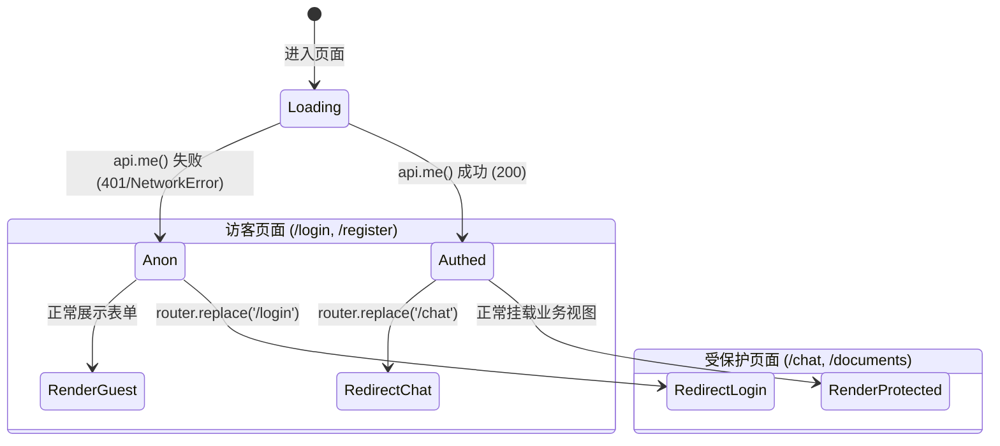
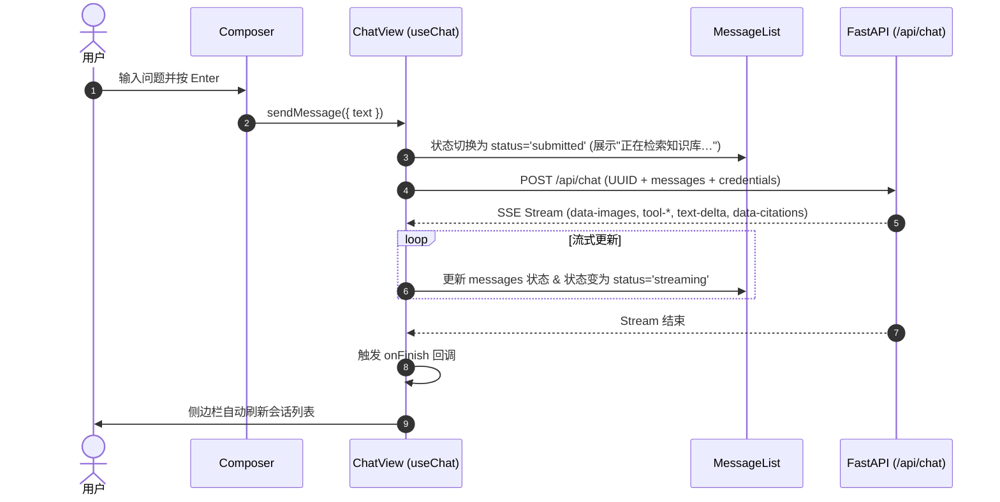
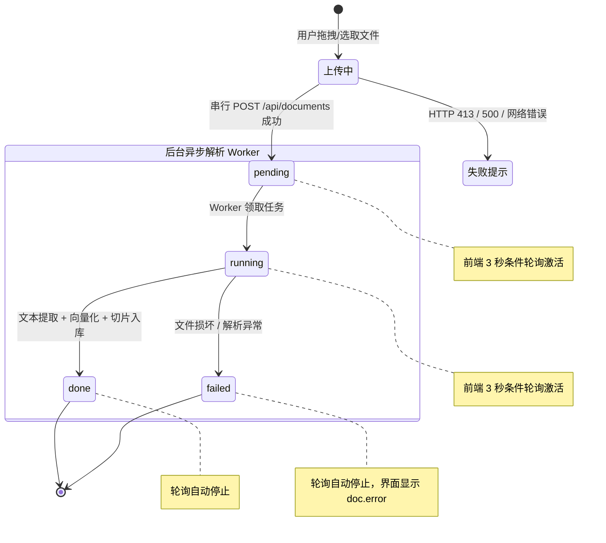
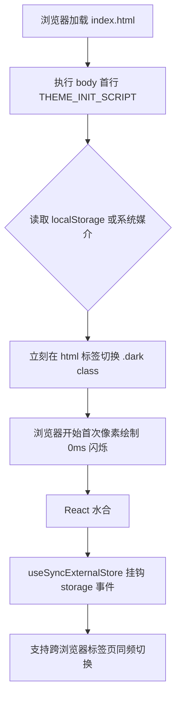

# 旗舰版 ERP 知识库助手 — 前端架构与系统设计技术白皮书

> **文档用途**：本文档旨在为架构师、研发团队以及评审 AI 提供关于当前前端系统的完整技术规格、设计哲学、代码构造、数据流转、协议契约与潜在改进点的全景全量描述。

---

## 目录
1. [系统定位与业务全景](#1-系统定位与业务全景)
2. [硬件硬约束与架构权衡决策](#2-硬件硬约束与架构权衡决策)
3. [技术栈选型与依赖清单](#3-技术栈选型与依赖清单)
4. [工程目录与模块架构](#4-工程目录与模块架构)
5. [鉴权体系与客户端路由守卫](#5-鉴权体系与客户端路由守卫)
6. [聊天工作台与多段流式协议体系](#6-聊天工作台与多段流式协议体系)
7. [知识库文档管理与状态流转](#7-知识库文档管理与状态流转)
8. [侧边栏与会话状态管理](#8-侧边栏与会话状态管理)
9. [网络通信层与错误处理体系](#9-网络通信层与错误处理体系)
10. [设计系统、OKLCH 色彩与主题引擎](#10-设计系统oklch-色彩与主题引擎)
11. [构建配置与生产部署拓扑](#11-构建配置与生产部署拓扑)
12. [系统已知局限、技术债务与 AI 评审要点](#12-系统已知局限技术债务与-ai-评审要点)

---

## 1. 系统定位与业务全景

### 1.1 业务背景与产品定位
- **产品名称**：旗舰版 ERP 知识库助手 / 旺店通助手
- **核心场景**：
  1. **智能问答（RAG Chat）**：聚合语雀公开文档（爬取公开页并分块检索）与用户自传私有文档，提供精准带引用的步骤解答。
  2. **多模态与精准配图**：解析 ERP 操作手册中的多张图例，正文动态关联 `[图1]`、`[图2]`，支持点击大图预览。
  3. **Agent 过程透传与方案交付**：透传 Agent 内部的多步工具调用（如“检索知识库”、“生成方案”），并支持生成与一键下载 Excel 对账/配置方案。
  4. **知识库自助管理**：支持用户自助上传文档（md/txt/docx/pptx/pdf），监控后台解析进度，支持数据隔离与删除。
  5. **邀请制访问控制**：采用企业邮箱 + 专属邀请码注册登录，区分公共库与用户私有文档空间。

### 1.2 系统拓扑架构

```mermaid
flowchart TB
    subgraph Client [用户端 (Browser)]
        UI[Next.js 16 纯静态 SPA]
        Transport[Vercel AI SDK Transport]
        Store[useSyncExternalStore 状态池]
    end

    subgraph CDN_Nginx [接入层 (阿里云 ECS)]
        Nginx[Nginx 静态服务器]
    end

    subgraph Backend [服务端 (FastAPI 8000端口)]
        API[FastAPI Router]
        AuthSvc[JWT Auth 模块]
        ChatEngine[RAG / Agent 调度引擎]
        DocWorker[文档解析 Worker]
        Storage[(PostgreSQL + pgvector)]
    end

    Client -->|1. 静态资源拉取| Nginx
    Client -->|2. /api/chat 流式请求 (Cookie)| Nginx
    Client -->|3. /api/* REST 请求 (Cookie)| Nginx
    Nginx -->|反向代理 pass_proxy| API
    API --> AuthSvc
    API --> ChatEngine
    API --> DocWorker
    DocWorker --> Storage
    ChatEngine --> Storage
```

---

## 2. 硬件硬约束与架构权衡决策

服务器运行环境为 **阿里云 ECS（2 核 CPU / 1.6GB 可用物理内存 / 40GB 磁盘）**，部署了 PostgreSQL、FastAPI、文档解析 Worker 以及 Nginx。针对极紧的内存预算（常驻余量仅 ~300MB），前端做出了以下不可动摇的架构决策：

| 决策点 | 采取方案 | 放弃的备选方案 | 决策依据与收益 |
|---|---|---|---|
| **SSR vs 静态导出** | **纯静态导出 (`output: "export"`)** | Next.js Node.js 运行时 SSR / Server Actions | 服务器内存不足以维持 Node.js 进程（省下 150MB~300MB 内存），服务器端跑 `next build` 会直接 OOM。 |
| **实时状态同步** | **按需条件轮询（3秒间隔）** | WebSocket 长连接 / SSE 广播 | 文档解析几十秒完成一次，常驻 WebSocket 占用额外连接句柄和内存；轮询在全部文档 `done/failed` 后自动注销。 |
| **文件上传策略** | **前端单文件串行上传** | 多并发并行上传 | 避免用户一次选 5 个 20MB 文件并发打崩后端接收缓存。 |
| **WebFont 策略** | **系统原生无衬线字体栈** | Google Fonts / Geist WebFont | 避免构建期依赖外网下载导致断网失败；Geist 仅覆盖西文，对中文无益且增加首屏体积。 |
| **状态持久化** | **`useSyncExternalStore` 订阅** | `useEffect + useState` 读 `localStorage` | 解决 React 19 `set-state-in-effect` 规则报错；消除首帧读取延迟导致的主题/折叠闪烁。 |

---

## 3. 技术栈选型与依赖清单

```json
{
  "dependencies": {
    "@ai-sdk/react": "^4.0.69",
    "@base-ui/react": "^1.7.0",
    "ai": "^7.0.66",
    "class-variance-authority": "^0.7.1",
    "clsx": "^2.1.1",
    "lucide-react": "^1.31.0",
    "motion": "^13.1.0",
    "next": "16.3.1",
    "react": "19.2.8",
    "react-dom": "19.2.8",
    "react-markdown": "^10.1.0",
    "remark-gfm": "^4.0.1",
    "shadcn": "^4.18.0",
    "tailwind-merge": "^3.6.0",
    "tw-animate-css": "^1.4.0"
  },
  "devDependencies": {
    "@tailwindcss/postcss": "^4",
    "@types/node": "^20",
    "@types/react": "^19",
    "@types/react-dom": "^19",
    "eslint": "^9",
    "eslint-config-next": "16.3.1",
    "tailwindcss": "^4",
    "typescript": "^5"
  }
}
```

### 3.1 核心库选型理由
1. **Next.js 16.3.1 & React 19.2.8**：采用最新的 App Router 与 Client Component 机制，构建产物精简，天然支持与 AI SDK 的深度适配。
2. **Tailwind CSS v4 (`@tailwindcss/postcss`)**：使用纯 CSS 变量与 `@theme inline` 驱动，完全摆脱传统 `tailwind.config.js`，极大加快静态导出编译速度。
3. **Base UI (`@base-ui/react`) + shadcn**：基于 Base UI 无样式可访问性原语（无 Headless UI 复杂运行时），定制 Base Nova 现代扁平设计风格。
4. **Vercel AI SDK (`ai` & `@ai-sdk/react`)**：使用标准化多段数据流解析模型，原生对接后端的流式 Tool Call 与 Data Parts。
5. **Motion v13**：用于侧边栏平滑折叠、移动端抽屉手势以及列表挂载淡入动效。

---

## 4. 工程目录与模块架构

```
frontend/
├── app/                                  # Next.js App Router 路由与页面层
│   ├── chat/                             # 核心工作台：对话与会话流
│   │   └── page.tsx                      # 状态宿主：会话调度、侧边栏联动、ChatView 实例化
│   ├── documents/                        # 知识库管理：我的文档
│   │   └── page.tsx                      # 拖拽上传、条件轮询、状态Badge、文档删除
│   ├── login/                            # 鉴权：登录页
│   │   └── page.tsx                      # 账号密码表单、登录守卫
│   ├── register/                         # 鉴权：注册页
│   │   └── page.tsx                      # 邀请码注册表单、登录守卫
│   ├── favicon.ico                       # 站点图标
│   ├── globals.css                       # 全局样式系统、OKLCH Tokens、prose 排版、网格背景
│   ├── layout.tsx                        # 根布局：注入防白屏脚本、系统字体栈、视口元数据
│   └── page.tsx                          # 根落地页：分流路由 (/chat 或 /login)
├── components/                           # 组件层
│   ├── auth-shell.tsx                    # 登录/注册通用磨砂玻璃外框与微光晕卡片
│   ├── chat/                             # 聊天领域专用组件
│   │   ├── agent-trace.tsx               # Agent 过程追踪 (ToolStep) & Excel 下载卡片 (DownloadCard)
│   │   ├── chat-view.tsx                 # 单会话视图容器 (useChat 实例化、重试、流中断)
│   │   ├── citations.tsx                 # 知识库引用折叠列表（来源编号、标题、小节、外部链接）
│   │   ├── composer.tsx                  # 底部输入框（高度自适应、快捷键、输入法防断、发送/停止）
│   │   ├── markdown-content.tsx          # Markdown 正文（GFM表格、代码高亮复制、[图N] 动态嵌入）
│   │   ├── message-list.tsx              # 消息流容器（空状态 Hero + 场景入口、文档流排版、平滑滚动）
│   │   └── sidebar.tsx                   # 侧边栏（时间分组、搜索过滤、主题切换、平滑折叠）
│   └── ui/                               # shadcn / Base UI 通用原子组件
│       ├── alert.tsx                     # 警告与错误提示条
│       ├── badge.tsx                     # 状态徽标 (Outline, Secondary, Destructive)
│       ├── button.tsx                    # 交互按钮 (CVA 变体: default, outline, ghost, destructive)
│       ├── card.tsx                      # 卡片容器 (Header, Content, Description, Title)
│       ├── input.tsx                     # 单行文本框
│       ├── label.tsx                     # 表单标签
│       └── textarea.tsx                  # 多行自适应文本框
├── lib/                                  # 核心基础设施与网络/状态工具库
│   ├── api.ts                            # FastAPI 客户端接口（fetch 封装、credentials、422 错误提取）
│   ├── auth-guard.ts                     # 客户端路由守卫 Hook (useRequireAuth, useRedirectIfAuthed)
│   ├── chat-types.ts                     # AI SDK 协议扩展类型 (CopilotDataParts, UIMessage 辅助工具)
│   ├── persisted-flag.ts                 # 基于 useSyncExternalStore 的跨标签持久化布尔状态 Hook
│   ├── theme.ts                          # 零闪烁深色模式 Hook 与同步内联脚本
│   └── utils.ts                          # 通用 class 合并工具 (cn = clsx + tailwind-merge)
├── components.json                       # shadcn UI 配置文件
├── next.config.ts                        # Next.js 配置（静态导出、尾斜杠、图片免优化）
├── package.json                          # 依赖声明与 scripts
├── postcss.config.mjs                    # PostCSS 配置
└── tsconfig.json                         # TypeScript 配置
```

---

## 5. 鉴权体系与客户端路由守卫

### 5.1 鉴权传输模型 (Cookie-based Session)
- 登录成功后，FastAPI 通过 `Set-Cookie` 写入带有 `HttpOnly; SameSite=Lax; Path=/` 的 JWT Token。
- **跨源与同源兼容**：`API_BASE` 在开发环境为 `http://localhost:8000`，生产环境为空字符串（同源反代）。所有 fetch 请求与 AI SDK transport 均配置 `credentials: "include"`，浏览器自动附加 Cookie。

### 5.2 客户端守卫状态机与流程图



### 5.3 守卫源码关键实现 (`lib/auth-guard.ts`)
```typescript
export function useRequireAuth(): AuthState {
  const router = useRouter();
  const [state, setState] = useState<AuthState>({ status: "loading", user: null });

  useEffect(() => {
    let alive = true;
    api.me()
      .then((user) => alive && setState({ status: "authed", user }))
      .catch(() => {
        if (!alive) return;
        setState({ status: "anon", user: null });
        router.replace("/login");
      });
    return () => { alive = false; };
  }, [router]);

  return state;
}
```
*注：静态导出无 Node 中间件，此客户端守卫仅用于优化用户体验（防发呆），真正的安全边界在 FastAPI 接口层。*

---

## 6. 聊天工作台与多段流式协议体系

### 6.1 AI SDK 多段流式协议与类型扩展 (`lib/chat-types.ts`)

后端 FastAPI 使用 SSE 流式协议下发自定义 Data Parts。前端对 `CopilotUIMessage` 进行强类型扩展：

```typescript
export type CopilotDataParts = {
  conversation: { id: string; title: string };
  citations: { citations: Citation[] };
  images: { images: AnswerImage[] };
  download: { url: string; name: string };
};

export type AnswerImage = { n: number; url: string };
export type ToolStep = { id: string; name: string; done: boolean; failed: boolean };
export type CopilotUIMessage = UIMessage<unknown, CopilotDataParts>;
```

#### 各协议 Part 的消费生命周期与规则：
1. **`data-conversation`**：在会话标题生成后推送，通知前端同步更新侧边栏对话标题。
2. **`data-images`**：**在正文流式输出前提前到达**。前端需提前拿到图片编号与静态 URL 对照表，以便正文流式打字到达 `[图1]` 时立即替换为真实图片。
3. **`data-citations`**：在 RAG 检索命中材料后随流推送。**防幻觉规则**：后端判定模型回答“知识库暂无此内容”时，根本不发该片段，前端无引用即不展示折叠栏。
4. **`data-download`**：Agent 完成方案编写后生成 xlsx 路径，前端渲染下载卡片。
5. **`tool-<name>`**：AI SDK 将服务端执行的工具收拢为 `tool-` 开头的 Part，服务端已提前将 `search_kb` 映射为中文“检索知识库”，前端直接展示运行态/完成态/失败重试态。

---

### 6.2 单会话视图容器与状态调度 (`components/chat/chat-view.tsx`)



- **UUID 强约束**：`ChatPage` 初始化与每次点击“新建对话”均调用 `crypto.randomUUID()`，杜绝 AI SDK 默认 nanoid 导致后端会话索引失效。
- **强制组件重挂**：`ChatView` 以 `key={chatId}` 挂载，一旦切换历史会话，内部的 `messages`、`draft`、`error` 彻底释放重建，防止旧会话状态串台。

---

### 6.3 富文本排版与图文智能渲染 (`components/chat/markdown-content.tsx`)

```typescript
const IMAGE_REF_RE = /\[图\s*(\d{1,2})\]/g;

function inlineImages(content: string, images: AnswerImage[]): string {
  if (images.length === 0) return content.replace(IMAGE_REF_RE, "");
  const byNumber = new Map(images.map((img) => [img.n, img.url]));
  return content.replace(IMAGE_REF_RE, (_, n: string) => {
    const url = byNumber.get(Number(n));
    return url ? `` : "";
  });
}
```

#### 关键渲染特性：
1. **配图防幻觉剔除**：模型偶尔会凭空写出超出实际配图数量的编号（如只有 2 张图却写了 `[图5]`）。`inlineImages` 查不到映射直接将其置空抹除，既不出现死链，也不出现生硬的文字方括号。
2. **根相对路径解析**：图片 URL 格式为 `/images/...`，渲染时自动拼接 `API_BASE`。
3. **代码高亮与交互**：支持 GFM 语法，代码块采用深色卡片封装，顶部附带语言标识与一键复制功能。
4. **表格自适应**：包裹横向滚动容器，配置斑马纹与圆角边框。

---

### 6.4 输入控制器细节设计 (`components/chat/composer.tsx`)

- **自适应伸缩**：基于 `scrollHeight` 动态计算高度（最低 48px，最高 200px），内容清空时自动还原。
- **中文输入法（IME）保护**：
  ```typescript
  onKeyDown={(e) => {
    if (e.key === "Enter" && !e.shiftKey && !e.nativeEvent.isComposing) {
      e.preventDefault();
      submit();
    }
  }}
  ```
  检测到 `isComposing === true`（用户正在拼音选词按回车）时直接放行，不触发提交。
- **打断与发送状态切换**：生成中展示红色方块停止按钮（`onStop`），非生成态展示黑色圆形发送按钮。

---

## 7. 知识库文档管理与状态流转

### 7.1 文档生命周期状态机 (`app/documents/page.tsx`)



### 7.2 性能与可靠性设计
1. **条件式按需轮询**：
   ```typescript
   const pending = docs.some((d) => DOC_IN_PROGRESS.includes(d.status));
   useEffect(() => {
     if (auth.status !== "authed" || !pending) return;
     const timer = setInterval(refresh, 3000);
     return () => clearInterval(timer);
   }, [auth.status, pending, refresh]);
   ```
2. **乐观插入 (Optimistic Insert)**：上传接口响应成功后，立即将返回的 `DocumentSummary` 推入列表首位，用户无需等待 3 秒轮询即可看到“排队中”。
3. **串行限流上传**：使用 `for...of` 串行处理选中的多文件，严控服务器网络带宽与瞬时内存压力。
4. **即时删除与异常回滚**：删除操作先从前端 state 移除，若后端接口报错则回滚并弹出通知。

---

## 8. 侧边栏与会话状态管理

### 8.1 智能时间分组算法 (`components/chat/sidebar.tsx`)
系统将历史会话根据 `created_at` 严格划分为 4 个时间分区：
- **今天**：时间戳 $\ge$ 当日 00:00:00；
- **昨天**：当日 00:00:00 $>$ 时间戳 $\ge$ 昨天 00:00:00；
- **前 7 天**：昨天 00:00:00 $>$ 时间戳 $\ge$ 7天前 00:00:00；
- **更早**：时间戳 $<$ 7天前。

### 8.2 平滑折叠与动效系统
- **折叠状态切换**：桌面端支持 260px 宽度与 64px 极简折叠态。
- **Blur-Fade 文字过渡**：
  ```tsx
  <span
    className="truncate transition-all whitespace-nowrap overflow-hidden"
    style={{
      opacity: collapsed ? 0 : 1,
      filter: collapsed ? "blur(4px)" : "blur(0px)",
      width: collapsed ? 0 : "auto",
      transitionProperty: "opacity, filter, width",
      transitionDuration: "200ms",
      transitionTimingFunction: "cubic-bezier(0.16, 1, 0.3, 1)",
    }}
  >
    {children}
  </span>
  ```
- **删除按钮防误触与无障碍**：采用 `opacity-0 group-hover:opacity-100 focus-visible:opacity-100`，保持视觉安静的同时保障键盘 Tab 无障碍导航可用。

---

## 9. 网络通信层与错误处理体系

### 9.1 API 封装规范 (`lib/api.ts`)

```typescript
// 1. JSON 通用请求封装
async function request<T>(path: string, init?: RequestInit): Promise<T> {
  let res: Response;
  try {
    res = await fetch(`${API_BASE}${path}`, {
      ...init,
      credentials: "include",
      headers: { "Content-Type": "application/json", ...init?.headers },
    });
  } catch {
    throw new ApiError("连不上服务器，请确认后端已启动。", 0);
  }
  // 错误处理与 422 解析...
}

// 2. 独立上传通道 (绝不能加 Content-Type 头，由浏览器自动生成 multipart boundary)
async function upload(path: string, file: File): Promise<UploadResult> {
  const form = new FormData();
  form.append("file", file);
  const res = await fetch(`${API_BASE}${path}`, { method: "POST", credentials: "include", body: form });
  // ...
}
```

### 9.2 FastAPI 错误模型解析算法
FastAPI 的错误格式包含普通错误 `{ detail: "string" }` 与 Pydantic 校验错误 `{ detail: [{ msg: "string", ... }] }`。`readDetail` 适配所有可能格式：
```typescript
function readDetail(body: unknown, fallback: string): string {
  if (typeof body !== "object" || body === null) return fallback;
  const detail = (body as { detail?: unknown }).detail;
  if (typeof detail === "string") return detail;
  if (Array.isArray(detail)) {
    const msgs = detail
      .map((d) => (typeof d === "object" && d !== null ? (d as { msg?: string }).msg : null))
      .filter((m): m is string => Boolean(m));
    if (msgs.length) return msgs.join("；");
  }
  return fallback;
}
```

---

## 10. 设计系统、OKLCH 色彩与主题引擎

### 10.1 OKLCH 双模式色彩空间定义 (`app/globals.css`)

```css
/* 浅色模式：Claude / Linear 风格温暖纸质白 */
:root {
  --background: oklch(0.985 0.002 90);
  --foreground: oklch(0.141 0.005 285);
  --card: oklch(1 0 0);
  --card-foreground: oklch(0.141 0.005 285);
  --primary: oklch(0.205 0.015 265);
  --primary-foreground: oklch(0.985 0 0);
  --muted: oklch(0.955 0.003 90);
  --muted-foreground: oklch(0.45 0.005 265);
  --border: oklch(0.915 0.004 90);
  --sidebar: oklch(0.97 0.003 90);
  --sidebar-border: oklch(0.915 0.004 90);
  --shadow-subtle: 0 1px 2px 0 oklch(0 0 0 / 0.04);
  --shadow-floating: 0 4px 16px -2px oklch(0 0 0 / 0.1), 0 2px 4px -2px oklch(0 0 0 / 0.06);
}

/* 深色模式：深沉冷调灰黑 (非刺眼 OLED 纯黑) */
.dark {
  --background: oklch(0.13 0.005 265);
  --foreground: oklch(0.93 0.005 90);
  --card: oklch(0.16 0.005 265);
  --primary: oklch(0.90 0.005 90);
  --primary-foreground: oklch(0.16 0.005 265);
  --muted: oklch(0.20 0.005 265);
  --muted-foreground: oklch(0.60 0.005 265);
  --border: oklch(1 0 0 / 8%);
  --sidebar: oklch(0.14 0.005 265);
  --sidebar-border: oklch(1 0 0 / 8%);
  --shadow-subtle: 0 1px 2px 0 oklch(0 0 0 / 0.2);
  --shadow-floating: 0 4px 16px -2px oklch(0 0 0 / 0.4), 0 2px 4px -2px oklch(0 0 0 / 0.25);
}
```

### 10.2 零白屏闪烁主题引擎 (`lib/theme.ts`)



---

## 11. 构建配置与生产部署拓扑

### 11.1 构建配置 (`next.config.ts`)
```typescript
import type { NextConfig } from "next";

const nextConfig: NextConfig = {
  // 1. 纯静态导出，服务器零 Node 运行时开销
  output: "export",
  // 2. 导出为 out/<route>/index.html，完美适配 Nginx try_files
  trailingSlash: true,
  // 3. 禁用 Next.js 服务端图片优化服务器
  images: { unoptimized: true },
};

export default nextConfig;
```

### 11.2 Nginx 生产反代配置片段
```nginx
server {
    listen 443 ssl http2;
    server_name liushun666.cn;

    # 静态前端资源托管
    root /var/www/copilot/out;
    index index.html;

    location / {
        try_files $uri $uri/ /index.html;
    }

    # 后端接口与流式 SSE 反代
    location /api/ {
        proxy_pass http://127.0.0.1:8000;
        proxy_set_header Host $host;
        proxy_set_header X-Real-IP $remote_addr;
        proxy_set_header X-Forwarded-For $proxy_add_x_forwarded_for;
        proxy_set_header X-Forwarded-Proto $scheme;

        # SSE 流式连接必须关闭 buffer，否则流式打字会卡住一次性喷出
        proxy_buffering off;
        proxy_cache off;
        proxy_read_timeout 300s;
    }

    # 上传文件静态直发 (图片与导出文件)
    location /images/ {
        alias /var/data/copilot/images/;
        expires 30d;
    }
}
```

---

## 12. 系统已知局限、技术债务与 AI 评审要点

> **给评估/改进 AI 的专项提示**：请针对以下已识别的架构局限、潜在风险与扩展需求进行深度评审并提供优化方案：

### 12.1 性能与渲染维度 (Performance & Rendering)
1. **长会话渲染开销**：`MessageList` 尚未引入虚拟滚动（Virtual List）。当单会话多轮对话超过 50 条且包含大量 Markdown 复杂表格时，DOM 节点增多可能引发轻微卡顿。
2. **Markdown 解析粒度**：`MarkdownContent` 虽然使用了 `memo`，但在流式输出期间（每收到一个字符 token 即重新渲染整个 Markdown 树），大篇幅回答可能消耗较多 CPU。可评估是否引入流式增量 AST 解析或分块 Memo 化。
3. **图片加载与布局抖动 (CLS)**：知识库截图使用标准 `` 标签并标记 `loading="lazy"`，但在尺寸未加载完成前可能产生轻微 Cumulative Layout Shift。

### 12.2 网络与容错维度 (Network & Resilience)
1. **网络闪断与断流重连**：`useChat` 在遭遇网络突然中断（如移动端切换 Wi-Fi）时，仅抛出常规 Error 提示重试，缺乏流式断点续传（Stream Resume）机制。
2. **Token 过期静默刷新**：当前 `useRequireAuth` 仅在挂载时调用 `api.me()`。若用户长时间停留在聊天页面且 JWT Token 过期，下一个聊天请求会触发 401，需优化为全局 401 拦截并优雅跳转登录。
3. **并发上传限制**：前端虽然做了单文件串行，但若用户一次性拖入 20 个大文件，UI 仍需长时间等待，可评估是否增加可视化的队列进度管理面板。

### 12.3 状态管理与扩展性 (State Management & Scalability)
1. **全局状态总线缺失**：目前状态由各个页面自持并通过 Props 传递（如 `ChatPage` 调度 `Sidebar` 与 `ChatView`）。如果未来扩展全局通知中心、后台任务浮窗、多会话并发问答，是否需要引入轻量状态库（如 Zustand / Jotai）？
2. **多会话缓存策略**：切换左侧历史会话时每次均重新调用 `api.messages(id)`。可评估是否加入 LRU 内存缓存，避免重复拉取已读会话。

### 12.4 无障碍与可用性 (Accessibility & a11y)
1. **键盘快捷键体系**：目前支持 Enter 发送与 Shift+Enter 换行，尚未提供 `Cmd/Ctrl + K` 呼出全局搜索或快速新建会话的全局快捷键。
2. **移动端软键盘适配**：iOS Safari 下唤起虚拟键盘时，底部输入卡片的 `env(safe-area-inset-bottom)` 与视口挤压体验仍有进一步精细化调优空间。
